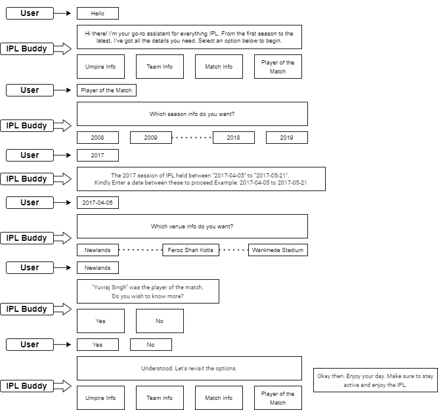

# IPL Buddy

<h2>Project Development Journal</h2>

<h3><code style="color:blue">Tech stack</code></h3>

<strong>
<ul>
    <li>Chabot platform: Google Dialogflow Console</li>
    <li>Database: MySQL</li>
    <li>Backend framwork: FastAPI</li>
    <li>Production Database: aiven.io</li>
    <li>Production server: render.com</li>
    <li>Integration site: Huggingface</li>
</ul>
</strong>

<h3><code style="color:blue">Integration</code></h3>

<strong>I integrated my chatbot using google dialoglfow messenger api. I created a basic UI just for the sake of chatbot testing and deployed the website in huggingface. You can check it out <a href="https://huggingface.co/spaces/nelbarman053/IPL-Chat-Buddy">here</a>. Below the code snippet is given, in case you want to integrate and test: - </strong>

    
    <df-messenger
    intent="WELCOME"
    chat-title="IPL_BOT"
    agent-id="cc8dfc8c-36c0-420e-9c7b-aeb2ba566a1c"
    language-code="en"
    ></df-messenger>

<h3><code style="color:blue">Conversation Flow Diagrams</code></h3>

<h4>Team Info</h4>

<h4>Match Info</h4>

<h4>Umpire Info</h4>

<h4>Player of the Match</h4>

<h3><code style="color:blue">Conversation snaps</code></h3>

<table>
    <tr>
        <td></td>
        <td></td>
    </tr>
     <tr>
        <td></td>
        <td></td>
    </tr>
      <tr>
        <td></td>
    </tr>
</table>

